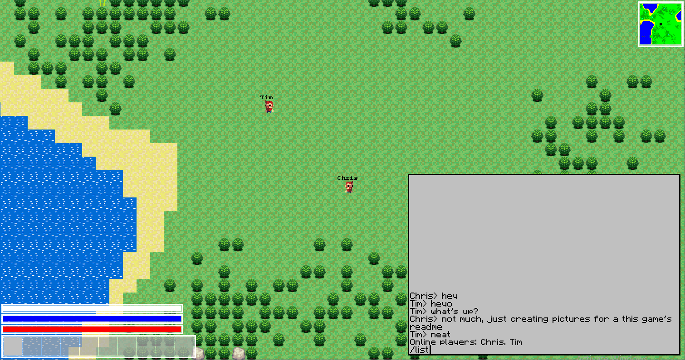

# UrfQuest
UrfQuest is a 2d, top-down, grid-based, procedural survival/adventure game with multiplayer capability.

## Usage
- Install [Java](https://www.java.com/en/download/)
- Download [UrfQuest jar file](https://github.com/SimNine/UrfQuest/releases/latest)
- Run UrfQuest jar file

## Controls
Main window:
 - WASD - movement
 - Number keys 1-9 - select item
 - Enter - use selected item
 - T - open chat window
 - M - fullscreen minimap

## Screenshots

TBD